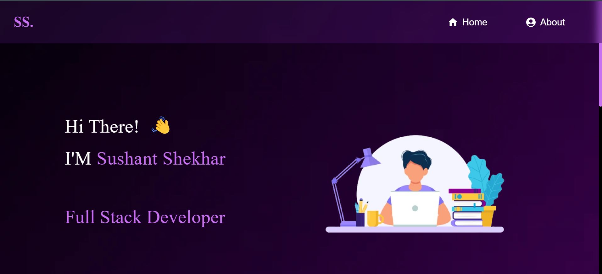
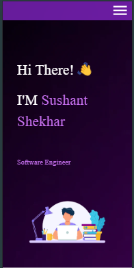

  
   <h1 align="center">Portfolio Website</h1>
   

    <a   href="https://sushant-shekhar-portfolio.netlify.app/">Sushant Shekhar</a>

## Desktop View

  

## Mobile View

  

## Built With
My personal portfolio
 <a   href="https://sushant-shekhar-portfolio.netlify.app/">Sushant Shekhar</a>
Explore my portfolio to learn more about me, view my resume, and discover my technical skills and expertise.

 
This project was built using these technologies.
 
 

  
  
  

## Features

📖 Multi-Page Layout

🎨 Styled with React-MUI

📱 Fully Responsive

## Getting Started
Clone down this repository. You will need node.js and git installed globally on your machine.

## 🛠 Installation and Setup Instructions
Installation: npm install

In the project directory, you can run: npm start

Runs the app in the development mode.
Open http://localhost:3000 to view it in the browser. The page will reload if you make edits.
